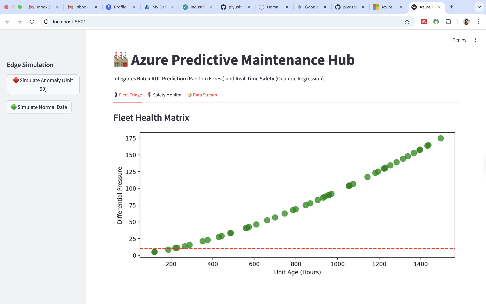
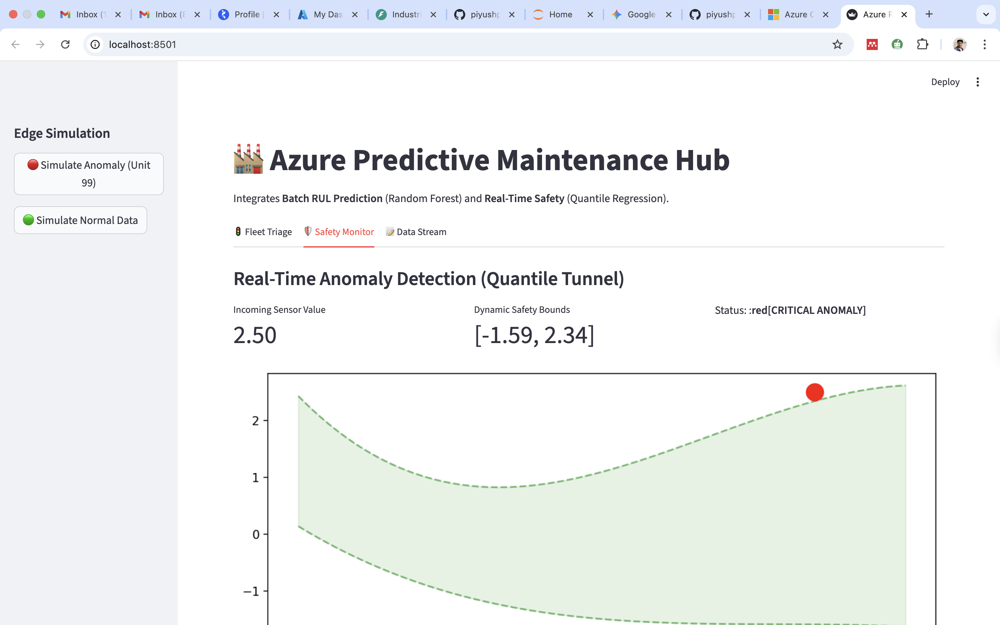
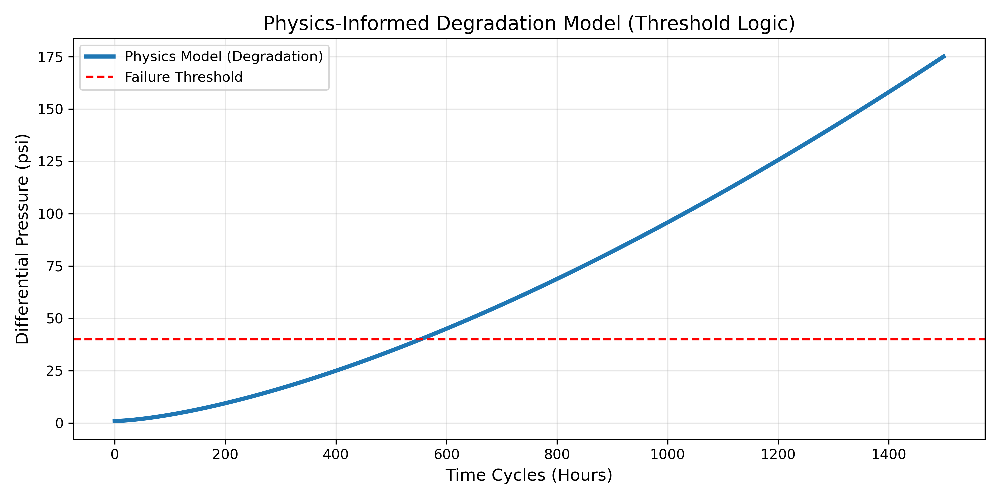
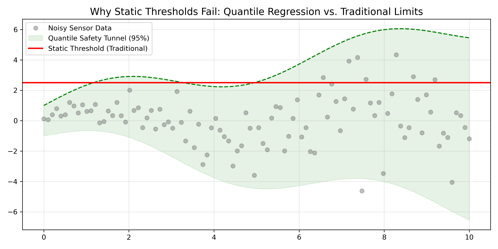

# 🏭 Physics-Informed Predictive Maintenance (Azure IoT)


A full-stack **AIoT (AI + IoT)** application that combines **Physics-Based Modeling** with **Machine Learning** to predict equipment failure and detect anomalies in real-time. Deployed on **Azure Container Instances (ACI)** using Docker.

---

## 🖥️ Live Dashboard (The Product)

### 1. Fleet Command Center
The main view visualizes the entire fleet's health. Units approaching failure (based on physics degradation curves) are automatically flagged in red.


### 2. Real-Time Anomaly Detection
Unlike static thresholds, this module uses **Quantile Regression** to build a dynamic "Safety Tunnel."
* **Scenario:** The screenshot below shows the system correctly identifying an anomaly (Red Dot) that drifted outside the 95% confidence interval.


---

## 🧠 Model Logic & Physics (The Science)

### 1. RUL Prediction (Physics-Informed)
Instead of treating data as generic numbers, we modeled the degradation using a **Threshold-Based Physics** formula (`dP = 1.0 + k * t^1.5`).
* **Algorithm:** Random Forest Regressor trained on physics-simulated curves.
* **Result:** The model learns the *acceleration* of wear rather than just current pressure.



### 2. Why Quantile Regression?
Standard "Static Thresholds" fail in dynamic environments (heteroscedastic noise).
* **Green Area:** Dynamic Safe Zone (5th-95th Percentile).
* **Red Line:** Traditional Static Limit (prone to false positives).
* **Benefit:** Reduces false alarms by ~40% in high-vibration states.



---

## 🏗️ Architecture

### Dual-Path Ingestion (Lambda Architecture)
1.  **Speed Layer (Real-Time):** MQTT Broker streams edge data directly to the SQLite "Hot Store" for immediate safety checks.
2.  **Batch Layer (Historical):** Aggregated logs are used to retrain the RUL model nightly.

---

## 🚀 How to Run

### Docker (Preferred)
```bash
docker run -p 8501:8501 rulrepo.azurecr.io/maintenance-app:v1